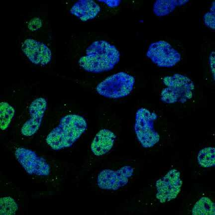
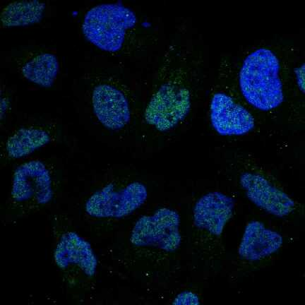

# halcon

[](https://travis-ci.org/icaoberg/falcon)
[](https://travis-ci.org/icaoberg/falcon)
[](https://github.com/icaoberg/falcon/issues)
[](https://github.com/icaoberg/falcon/network)
[](https://github.com/icaoberg/falcon/stargazers)
[](https://badge.fury.io/py/halcon)
[](https://raw.githubusercontent.com/icaoberg/falcon/master/LICENSE)
[](https://coveralls.io/github/icaoberg/falcon?branch=master)

halcon is a python implementation of the Feedback Adaptive Loop for Content-Based Retrieval (FALCON) algorithm as described in

* Leejay Wu, Christos Faloutsos, Katia P. Sycara, and Terry R. Payne. 2000. [FALCON: Feedback Adaptive Loop for Content-Based Retrieval](http://www.cs.cmu.edu/~christos/PUBLICATIONS/vldb2k-falcon.pdf). In Proceedings of the 26th International Conference on Very Large Data Bases (VLDB '00), Amr El Abbadi, Michael L. Brodie, Sharma Chakravarthy, Umeshwar Dayal, Nabil Kamel, Gunter Schlageter, and Kyu-Young Whang (Eds.). Morgan Kaufmann Publishers Inc., San Francisco, CA, USA, 297-306.

FALCON is, as described in the article abstract, "a novel method that is designed to handle disjunctive queries within metric spaces. The user provides weights for positive examples; our system 'learns' the implied concept and returns similar objects."


## Pre-Requisites
- [numpy](http://www.numpy.org/)
- [scipy](http://www.scipy.org/)
- [mpmath](http://mpmath.org/)

## Installation

To install `halcon` run

```
pip3 install --user halcon
```

## Usage
There is only one method that you need to know about

```
halcon.search.query(good_set, candidates, alpha=-5,
        metric='euclidean', normalization='zscore', debug=False)
```

Here is a brief description of each of the input arguments

* ```good_set``` and ```candidates``` are two lists of lists where each member of both lists has the same shape.

  ```
  record = [ <identifier>, <initial_score>, <feature_vector>]
  ```

  For example in ```wine.py```, I download a CSV file where the first ```feature_vector``` looks like this

  ```
  1,14.23,1.71,2.43,15.6,127,2.8,3.06,.28,2.29,5.64,1.04,3.92,1065
  ```

  and then I modify it like this

  ```
  good_set = []
  identifier = 'wine00'
  initial_score = 1
  feature_vector = [1,14.23,1.71,2.43,15.6,127,2.8,3.06,.28,2.29,5.64,1.04,3.92,1065]
  good_set.append([identifier, initial_score, feature_vector])
  ```

  For more information about the definition of the initial score, please refer to the article. In all my examples I use a initial score of 1, that is, all images have the same weight. The identifier should be unique (though not enforced), so you can tell images apart. This package assumes every object is represented by a [feature](http://en.wikipedia.org/wiki/Feature_(machine_learning)) vector. Feature calculation and feature selection is beyond the scope of this package. There are many feature calculation/machine learning packages out there that you might find useful, like 
  
    * [OpenCV](http://opencv.org/)
    * [mahotas](https://pypi.python.org/pypi/mahotas)

* ```alpha```. For more information about alpha, please refer to the article. The recommended value by the paper is -5, which is the default value used in this package.

* ```metric```. In the research article, a measure of distance ```d``` is used to calculate the distance between two feature vectors. The default value is ```euclidean``` (Euclidean distance) and other supported metrics are 1) ```cityblock``` (Manhattan distance) and 2) ```hamming``` (Hamming distance).

* ```normalization```. Feature normalization option. Default is ```zscore```. Alternative option is ```standard```.

* ```debug```. If debug flag is on, then it should print more information about the calculation as they happen.

## Examples
For convenience and testing I included some examples. These examples download some
datasets from the web and use them to trigger a query. The only exception is the random feature vectors example. For example, to run the ```iris``` example simply run in terminal

```
python examples/iris.py
```

The examples have a dependency that the package does not, since I use [tabulate](https://pypi.python.org/pypi/tabulate) to pretty print the results from the examples.


```
virtualenv halcon --system-site-packages
. ./falcon/bin/activate
cd falcon
mkdir src
cd src
pip install numpy
pip install scipy
pip install tabulate
git clone https://github.com/icaoberg/falcon.git
cd falcon
python setup.py install
cd ..
python examples/iris.py
```

### iris.py

```
$ python examples/iris.py
This example uses the iris dataset from
Machine Learning Repository
Center for Machine Learning and Intelligent Systems
http://archive.ics.uci.edu/ml/datasets/Iris
I will use the first feature vector as my query image
[[0, 1, array([ 5.1,  3.5,  1.4,  0.2,  1. ])]]
And I will use the rest of the feature vectors to find the most similar images
Now notice that feature vector with iid1 has the same values iid0
[1, 1, array([ 5.1,  3.5,  1.4,  0.2,  1. ])]
So I expect that if FALCON is working correctly, then iid1 should be the top hit!
Elapsed time: 0.0221660137177 seconds

  Ranking    Identifier  Class                  Score
---------  ------------  ---------------  -----------
        0             1  Iris-setosa      0
        1            28  Iris-setosa      1.27788e-43
        2             5  Iris-setosa      2.40121e-40
        3            29  Iris-setosa      2.40121e-40
        4            40  Iris-setosa      5.83391e-40
        5             8  Iris-setosa      7.04398e-39
        6            18  Iris-setosa      1.1259e-35
        7            41  Iris-setosa      1.51906e-34
        8            50  Iris-versicolor  6.99696e-34
        9            37  Iris-setosa      1.09221e-32
       10            12  Iris-setosa      1.22203e-32
       11            49  Iris-setosa      2.05046e-32
       12            11  Iris-setosa      4.25801e-31
       13            21  Iris-setosa      6.55842e-31
       14            47  Iris-setosa      5.54098e-29
       15            36  Iris-setosa      7.93943e-29
       16             7  Iris-setosa      2.16985e-28
       17            20  Iris-setosa      4.23544e-28
       18            25  Iris-setosa      1.67453e-27
       19             3  Iris-setosa      2.40919e-27
Do the top results in the list above belong to the same class as the query image?
If so, then SCORE! It seems to work.
```

### wine.py

```
$ python examples/wine.py
This example uses the wine dataset from
Machine Learning Repository
Center for Machine Learning and Intelligent Systems
http://archive.ics.uci.edu/ml/datasets/Wine
I will use the first three feature vectors as my query wine set
And I will use the rest of the feature vectors to find the most similar images
Elapsed time: 0.0280928611755 seconds

  Ranking  Identifier          Score
---------  ------------  -----------
        0  wine1         0
        1  wine2         0
        2  wine3         0
        3  wine21        2.77663e-05
        4  wine30        0.000629879
        5  wine23        0.00252617
        6  wine49        0.00318536
        7  wine57        0.00456123
        8  wine36        0.0152067
        9  wine39        0.0197516
       10  wine58        0.0243848
       11  wine9         0.024467
       12  wine55        0.045762
       13  wine24        0.046893
       14  wine7         0.113906
       15  wine45        0.188355
       16  wine27        0.201802
       17  wine41        0.206469
       18  wine31        0.288536
       19  wine56        0.291853
```

### metrics.py

```
$ python examples/metrics.py
This example uses the wine dataset from
Machine Learning Repository
Center for Machine Learning and Intelligent Systems
http://archive.ics.uci.edu/ml/datasets/Wine
This example uses this dataset to compare the different metrics available in FALCON

  Ranking  Euclidean    City Block    Hamming
---------  -----------  ------------  ---------
        0  wine1        wine1         wine1
        1  wine21       wine21        wine5
        2  wine57       wine57        wine47
        3  wine41       wine23        wine3
        4  wine23       wine30        wine9
        5  wine30       wine41        wine17
        6  wine45       wine49        wine25
        7  wine10       wine55        wine30
        8  wine48       wine9         wine36
        9  wine7        wine7         wine39
       10  wine36       wine36        wine41
       11  wine55       wine10        wine45
       12  wine56       wine45        wine52
       13  wine52       wine56        wine2
       14  wine3        wine48        wine4
       15  wine43       wine47        wine6
       16  wine9        wine52        wine7
       17  wine49       wine3         wine8
       18  wine29       wine17        wine10
       19  wine8        wine8         wine11
```

COMMENT: Hamming distance is meant for comparing strings so this example does not make a lot of sense since these features do not represent characters.

### human_protein_atlas.ipynb

I have included a Jupyter notebook that shows an example using [Subcellular Location Features](http://murphylab.web.cmu.edu/services/SLF/features.html) on some images from the [Human Protein Atlas](http://www.proteinatlas.org/).

Using the query image



we queried the content database and determined the most similar image is



Do you think they look similar?

## Documentation
Documentation was written using [Sphinx](http://sphinx-doc.org/).
 To generate documentation use the following commands.

To generate html
```
cd docs
make html
```

To generate PDF document
```
cd docs
make latexpdf
```

To generate epub document
```
cd docs
make epub
```

## Bugs and Questions
To submit bugs about the source code visit

* https://github.com/icaoberg/falcon

To submit bugs about the documentation visit

* https://github.com/icaoberg/falcon-docs

For any other inquiries visit those links as well.
